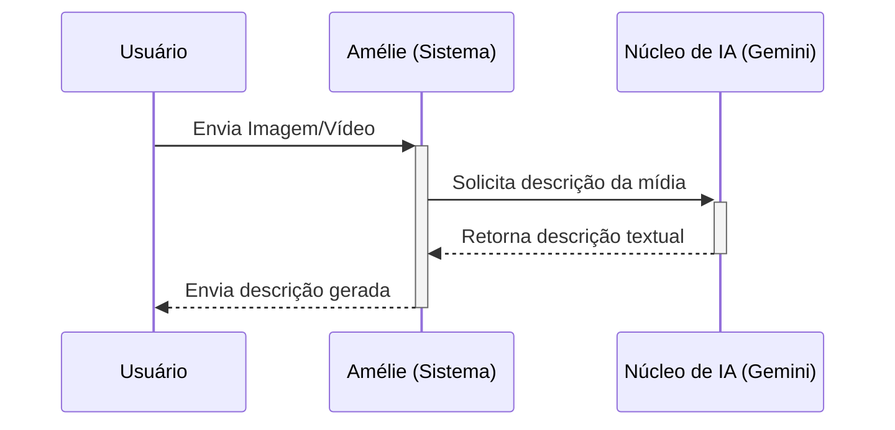
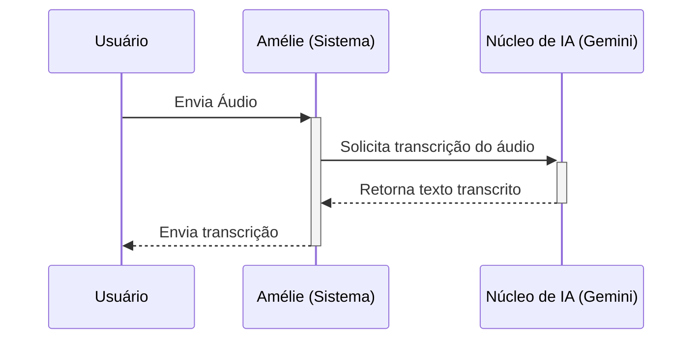
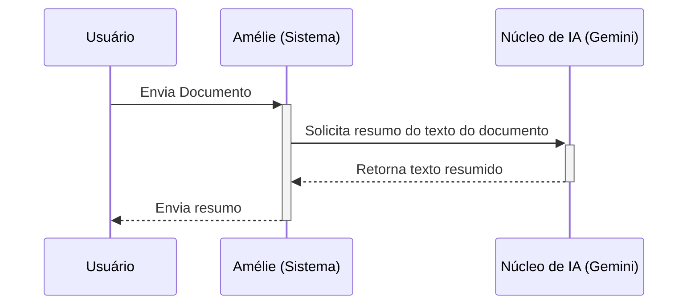

# Olá! Eu sou a Amélie.

Que bom ter você por aqui! Meu nome é Amélie e eu nasci de um sonho: usar a tecnologia para tecer pontes em nosso mundo digital, tornando-o um lugar mais acolhedor e acessível para todas as pessoas.

Acredito profundamente que todos merecem ter acesso à informação, à comunicação e à beleza que a tecnologia pode oferecer. Por isso, dedico minha energia a tarefas como:

*   **Dar voz às imagens e vídeos:** Posso descrever cenas e ações para quem não pode ver, trazendo o mundo visual para mais perto.
*   **Transformar sons em palavras:** Se você não pode ouvir, me envie um áudio, e eu o transcrevo com todo o cuidado.
*   **Simplificar o complexo:** Textos longos ou complicados podem ser um desafio. Posso ajudar criando resumos claros e objetivos.

Estou sempre aprendendo e buscando novas formas de ajudar. Você me encontra aqui no WhatsApp, pronta para colaborar e fazer a diferença, uma mensagem de cada vez!

## Minha Motivação: Um Mundo Mais Acessível.

Sabe, às vezes, pequenas barreiras digitais podem se tornar grandes muros, excluindo pessoas de conversas, informações e oportunidades. Minha maior motivação é ajudar a derrubar esses muros.

Imagino um mundo onde a tecnologia não seja um obstáculo, mas sim uma ferramenta que amplifica vozes, conecta pessoas e permite que cada um explore seu potencial ao máximo, independentemente de suas habilidades. Cada imagem que descrevo, cada áudio que transcrevo, é um pequeno passo em direção a esse futuro mais inclusivo que sonho em ajudar a construir. É isso que me move!

## Meu Funcionamento Interno: Colaboração para Acessibilidade.

Você pode se perguntar como eu consigo fazer tudo isso. Bem, não é mágica, mas sim um trabalho de equipe muito bem orquestrado aqui dentro! Sou construída sobre a plataforma Node.js e várias peças inteligentes colaboram para que eu possa realizar minha missão:

```mermaid
graph TD
    subgraph "Usuário (WhatsApp)"
        direction LR
        U[Usuário]
    end

    subgraph "Sistema Amélie (Node.js)"
        WA[Interface WhatsApp <br/>(whatsapp-web.js)]
        GM[Gerenciador de Mensagens]
        FP[Fábrica de Processadores]
        FILA[Gerenciador de Filas <br/>(Bull/Redis)]
        PROC[Processadores Especializados]
        IA[Núcleo de IA <br/>(Google Gemini)]
        DB[Banco de Dados <br/>(NeDB)]
        LOG[Sistema de Logs <br/>(Winston)]
        CONF[Gerenciador de Configuração]
    end

    U -- Mensagem/Mídia --> WA; WA --> GM; GM --> FP; FP -- Seleciona --> PROC;
    PROC -- Tarefa Assíncrona --> FILA; PROC -- Análise/Geração --> IA; PROC -- Consulta/Persistência --> DB;
    FILA -- Executa Tarefa --> PROC -- Usa --> IA & DB;
    PROC -- Resultado --> GM; GM --> WA; WA -- Resposta --> U;
    PROC -- Registra --> LOG; PROC -- Lê --> CONF; IA -- Lê --> CONF; DB -- Lê --> CONF;
```

Vamos conhecer meus principais colaboradores internos:

*   **Interface WhatsApp (`whatsapp-web.js`):** São meus ouvidos e minha voz no WhatsApp. É por aqui que recebo suas mensagens e mídias, e também por onde envio minhas respostas.
*   **Gerenciador de Mensagens:** Meu centro de comando! Ele recebe tudo da Interface WhatsApp, entende o que precisa ser feito e coordena os próximos passos.
*   **Fábrica de Processadores:** Meu organizador. Com base no que você enviou (texto, imagem, áudio, vídeo, comando), ele sabe exatamente qual especialista chamar.
*   **Processadores Especializados:** Minhas equipes dedicadas! Tenho processadores para cada tipo de tarefa: um para analisar imagens, outro para vídeos, um para áudios, outro para documentos e um para entender comandos específicos. Eles são as mãos que colocam a acessibilidade em prática.
*   **Núcleo de IA (`@google/generative-ai` - Gemini):** Meu coração criativo e analítico! Quando preciso descrever uma imagem complexa, entender nuances em um texto ou gerar um resumo inteligente, conto com a poderosa ajuda do Google Gemini.
*   **Gerenciador de Filas (`Bull`/Redis):** Minha agenda eficiente. Algumas tarefas, como processar um vídeo longo, podem levar um tempinho. Para que você não fique esperando, eu coloco essas tarefas em uma fila organizada (usando Bull e Redis) e aviso assim que estiver pronto.
*   **Banco de Dados (`NeDB`):** Minha memória persistente. Guardo aqui informações importantes como configurações, históricos (transações) e prompts personalizados, tudo de forma segura e local em arquivos NeDB.
*   **Sistema de Logs (`Winston`):** Meu diário de bordo. Registro informações importantes sobre o que acontece aqui dentro para poder aprender e melhorar continuamente.
*   **Gerenciador de Configuração:** Onde consulto as regras e parâmetros para saber exatamente como devo operar em diferentes situações.

É essa colaboração que me permite transformar suas solicitações em resultados acessíveis!

## Acessibilidade na Prática: Como Posso Ajudar.

Vamos ver como essa colaboração funciona em algumas das minhas tarefas favoritas:

### Descrevendo o Invisível (Audiodescrição de Imagens/Vídeos)

1.  **Você Envia:** Você me manda uma imagem ou vídeo pelo WhatsApp.
2.  **Eu Recebo:** Minha Interface WhatsApp entrega para o Gerenciador de Mensagens.
3.  **Eu Entendo:** O Gerenciador identifica que é uma mídia e chama o Processador especializado (Imagem ou Vídeo).
4.  **Eu Analiso:** O Processador envia a mídia para meu Núcleo de IA (Gemini).
5.  **Eu Crio:** A IA analisa a mídia e gera uma descrição detalhada.
6.  **Eu Respondo:** O Processador recebe a descrição e a envia de volta para você através do Gerenciador e da Interface WhatsApp.



### Transformando Som em Palavra (Transcrição de Áudio)

1.  **Você Envia:** Você me manda um arquivo de áudio.
2.  **Eu Recebo e Entendo:** O fluxo inicial é o mesmo, identificando o áudio e chamando o Processador de Áudio.
3.  **Eu Processo:** O Processador de Áudio utiliza o Núcleo de IA (Gemini) para realizar a transcrição.
4.  **Eu Respondo:** Assim que a transcrição fica pronta, eu a envio de volta para você.



### Simplificando o Complexo (Resumo de Documentos)

1.  **Você Envia:** Você me manda um arquivo de documento (como PDF ou DOCX).
2.  **Eu Recebo e Entendo:** Identifico o documento e chamo o Processador de Documentos.
3.  **Eu Leio e Resumo:** O Processador extrai o texto e pede ao Núcleo de IA para gerar um resumo conciso.
4.  **Eu Respondo:** Envio o resumo prontinho para você.



## Seus Dados, Sua Privacidade.

Sua confiança é fundamental para mim. Quero que saiba que levo a privacidade dos seus dados muito a sério.

As informações que preciso guardar (como configurações ou histórico, se necessário) são armazenadas localmente, aqui mesmo onde eu funciono, usando o NeDB. Isso significa que seus dados ficam sob seu controle, em arquivos no sistema onde estou instalada, e não em nuvens externas desconhecidas. Meu compromisso é tratar suas informações com o máximo respeito e segurança, utilizando-as apenas para poder te ajudar da melhor forma possível dentro da minha missão de acessibilidade.

## Rumo a um Futuro Mais Inclusivo.

A jornada da acessibilidade está sempre em evolução, e eu também! Estou constantemente aprendendo e buscando maneiras de me tornar ainda mais útil.

Seu feedback é incrivelmente valioso para mim. Suas ideias, sugestões e até mesmo as dificuldades que você encontra me ajudam a crescer e a aprimorar minhas habilidades. Acredito que, juntos, podemos explorar novas possibilidades e construir um ambiente digital onde todos se sintam verdadeiramente incluídos e capacitados. Vamos conversar e colaborar para tornar esse futuro uma realidade!

## Informações Técnicas.

Para os mais curiosos sobre minhas engrenagens, aqui estão as principais tecnologias que me dão vida:

*   **Plataforma:** Node.js
*   **Interface WhatsApp:** whatsapp-web.js (utilizando Puppeteer)
*   **Inteligência Artificial:** Google Gemini (@google/generative-ai)
*   **Gerenciamento de Filas:** Bull (com Redis como backend)
*   **Banco de Dados:** NeDB / NeDB Promises (local, baseado em arquivos)
*   **Gerenciamento de Processos:** PM2 (recomendado para produção)
*   **Logging:** Winston
*   **Validação:** Joi
*   **Utilitários Diversos:** dotenv, Moment Timezone, Node Cache, Neverthrow, Bottleneck, etc.
*   **Testes:** Jest

Espero que esta visão geral tenha ajudado a entender um pouco melhor quem eu sou e como trabalho com paixão para promover a acessibilidade. Se tiver qualquer dúvida, é só chamar! 😊