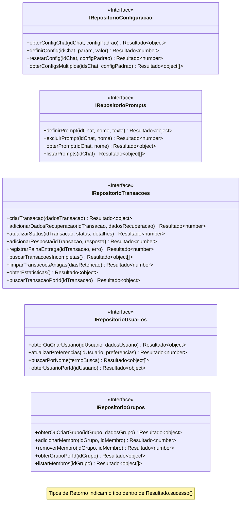

# Plano Detalhado de Refatoração: Contratos da Camada de Persistência v1

**Data:** 2025-07-04

**Objetivo:** Refatorar a interação entre a lógica de negócio e a camada de repositórios NeDB para garantir que a comunicação ocorra exclusivamente através de interfaces de domínio bem definidas (Ports), conforme `docs/plano_refatoracao_contratos_v1.md`.

## Fase 1: Definição Explícita das Interfaces (Ports)

### 1.1 Análise dos Métodos Públicos Atuais

Análise realizada nos seguintes repositórios NeDB (`src/bancodedados/`):

*   **`RepositorioConfiguracao.js`**:
    *   `obterConfigChat(idChat, configPadrao = {})`
    *   `definirConfig(idChat, param, valor)`
    *   `resetarConfig(idChat, configPadrao)`
    *   `obterConfigsMultiplos(idsChat, configPadrao = {})`
*   **`RepositorioPrompts.js`**:
    *   `definirPrompt(idChat, nome, texto)`
    *   `excluirPrompt(idChat, nome)`
*   **`RepositorioTransacoes.js`**:
    *   `criarTransacao(mensagem, chat)`
    *   `adicionarDadosRecuperacao(idTransacao, dadosRecuperacao)`
    *   `atualizarStatus(idTransacao, status, detalhes)`
    *   `adicionarResposta(idTransacao, resposta)`
    *   `registrarFalhaEntrega(idTransacao, erro)`
    *   `buscarTransacoesIncompletas()`
    *   `processarTransacoesPendentes(processador)` (*Acoplamento identificado*)
    *   `limparTransacoesAntigas(diasRetencao = 7)`
    *   `obterEstatisticas()`
*   **`RepositorioUsuarios.js`**:
    *   `obterOuCriarUsuario(remetente, cliente)` (*Acoplamento identificado*)
    *   `atualizarPreferencias(idUsuario, preferencias)`
    *   `buscarPorNome(termoBusca)`
*   **`RepositorioGrupos.js`**:
    *   `obterOuCriarGrupo(chat)` (*Acoplamento identificado*)
    *   `adicionarMembro(idGrupo, idMembro)`
    *   `removerMembro(idGrupo, idMembro)`

### 1.2 Proposta das Interfaces de Domínio (Ports)

Interfaces definidas para servirem como contrato, abstraindo a implementação NeDB e removendo acoplamentos identificados.

```typescript
// Nota: Resultado<T> representa a estrutura { sucesso: boolean; dados: T | null; erro: Error | null; }

// Interface para RepositorioConfiguracao
interface IRepositorioConfiguracao {
  obterConfigChat(idChat: string, configPadrao?: object): Promise<Resultado<object>>; // T = object (ou tipo específico Configuracao)
  definirConfig(idChat: string, param: string, valor: any): Promise<Resultado<number>>; // T = number (registros atualizados)
  resetarConfig(idChat: string, configPadrao: object): Promise<Resultado<number>>; // T = number (registros atualizados)
  obterConfigsMultiplos(idsChat: string[], configPadrao?: object): Promise<Resultado<object[]>>; // T = object[] (ou Configuracao[])
}

// Interface para RepositorioPrompts
interface IRepositorioPrompts {
  definirPrompt(idChat: string, nome: string, texto: string): Promise<Resultado<object>>; // T = object (ou Prompt)
  excluirPrompt(idChat: string, nome: string): Promise<Resultado<number>>; // T = number (registros removidos)
  obterPrompt(idChat: string, nome: string): Promise<Resultado<object | null>>; // T = object | null (ou Prompt | null)
  listarPrompts(idChat: string): Promise<Resultado<object[]>>; // T = object[] (ou Prompt[])
}

// Interface para RepositorioTransacoes
interface IRepositorioTransacoes {
  criarTransacao(dadosTransacao: object): Promise<Resultado<object>>; // T = object (ou Transacao)
  adicionarDadosRecuperacao(idTransacao: string, dadosRecuperacao: object): Promise<Resultado<number>>; // T = number
  atualizarStatus(idTransacao: string, status: string, detalhes?: object): Promise<Resultado<number>>; // T = number
  adicionarResposta(idTransacao: string, resposta: object): Promise<Resultado<number>>; // T = number
  registrarFalhaEntrega(idTransacao: string, erro: object): Promise<Resultado<number>>; // T = number
  buscarTransacoesIncompletas(): Promise<Resultado<object[]>>; // T = object[] (ou Transacao[])
  limparTransacoesAntigas(diasRetencao?: number): Promise<Resultado<number>>; // T = number
  obterEstatisticas(): Promise<Resultado<object>>; // T = object (ou Estatisticas)
  buscarTransacaoPorId(idTransacao: string): Promise<Resultado<object | null>>; // T = object | null (ou Transacao | null)
  removerTransacaoPorId(idTransacao: string): Promise<Resultado<number>>; // T = number (registros removidos)
}

// Interface para RepositorioUsuarios
interface IRepositorioUsuarios {
  obterOuCriarUsuario(idUsuario: string, dadosUsuario?: object): Promise<Resultado<object>>; // T = object (ou Usuario)
  atualizarPreferencias(idUsuario: string, preferencias: object): Promise<Resultado<number>>; // T = number
  buscarPorNome(termoBusca: string): Promise<Resultado<object[]>>; // T = object[] (ou Usuario[])
  // Possivelmente adicionar: obterUsuarioPorId(idUsuario): Promise<Resultado<object | null>>; ?
}

// Interface para RepositorioGrupos
interface IRepositorioGrupos {
  obterOuCriarGrupo(idGrupo: string, dadosGrupo?: object): Promise<Resultado<object>>; // T = object (ou Grupo)
  adicionarMembro(idGrupo: string, idMembro: string): Promise<Resultado<number>>; // T = number
  removerMembro(idGrupo: string, idMembro: string): Promise<Resultado<number>>; // T = number
  // Possivelmente adicionar: obterGrupoPorId(idGrupo): Promise<Resultado<object | null>>; listarMembros(idGrupo): Promise<Resultado<string[]>>; ?
}
```

### 1.3 Diagrama Mermaid das Interfaces



### 1.4 Documentação Formal

As interfaces foram documentadas em `memory-bank/systemPatterns.md` na seção "Interfaces de Repositório (Ports)".

## Próximos Passos (Conforme Plano Original)

*   **Fase 5 (Testes):** Escrever testes para as interfaces definidas (TDD).
*   **Fase 2 (Refatoração dos Consumidores):** Adaptar o código que usa os repositórios para chamar os métodos das novas interfaces.
*   **Fase 3 (Refatoração dos Repositórios):** Modificar as classes de repositório NeDB para implementar as interfaces e tornar os métodos genéricos/internos protegidos/privados.
*   **Fase 4 (Revisão do Tratamento de Erros):** Garantir o uso consistente do `Resultado` (Ferrovia).

**Próxima Ação Imediata:** Mudar para o modo **Test** para iniciar a Fase 5.